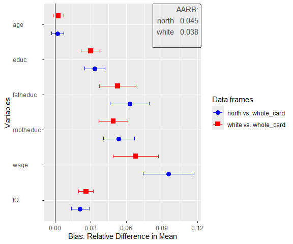
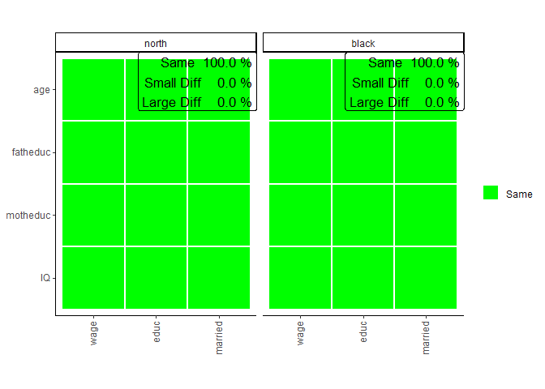

# Disclaimer:

This is only a beta version of sampcompR. It is still in development and
may contain bugs. If you use the package and a bug crosses your way,
feel free to contact the Author (<bjoern.rohr@gesis.org>).

# sampcompR

<!-- badges: start -->
<!-- badges: end -->

SampcompR aims to compare the similarity of one or more data frames with
one or more benchmark data frames. This is done on a univariate,
bivariate, and multivariate level. The main intention of the package was
to compare surveys to benchmark surveys, although other comparisons are
also viable. (e.g., mode-comparisons)  

-   On the univariate level, the variables with the same name in data
    frames and benchmarks are compared using one of the different
    measures. Then a plot can be generated to visualize the differences
    and present a value indicating the overall difference of all
    variables (e.g., average difference, RMSE).

-   On the bivariate level, Pearson’s r values can be compared between
    the data frames and the benchmarks. The results of this comparison
    can also be visualized with a plot in the form of a heatmap.

-   Last, on the multivariate level, the package can compare and
    visualize multivariate regression models between the data frames and
    the benchmarks.

## Installation

You can install the development version of sampcompR like so:

    ### Install the dependencies
    install.packages("devtools")

    # install.packages(c("boot", boot.pval, "data.table", "dplyr", "ggplot2", "Hmisc", "jtools","lmtest", "magrittr", "margins", "parallel", "psych", "reshape2", "readr", "svrep", "sandwich", "stats", "survey", "tidyselect", "utils","weights", "wooldridge"))

    ### Install the package
    devtools::install_github("BjoernRohr/sampcompR")

    library(sampcompR)

## Example

### Prepare the Data

When using the package, the first step is to load your data. It is
essential that the variables of comparison in the data frames and
respective benchmark data frames need to be named the same.
Additionally, it is best to try to measure the same constructs
similarly. For example, if you want to compare two surveys, it is best
if the same questions were used in the respective surveys for the
variables of comparison.

In our example, we will use the `card` data frame from the `wooldrige`
package as a base and split it into different sub-data frames. To keep
our examples simple, we will not use design weights, although design
weights can make a huge difference.

``` r
# install and load some additional packages for this readme
#install.packages("magrittr","knitr","kableExtra")
library(magrittr)
library(knitr)
library(kableExtra)

data("card")
whole_card<-card # the full survey

# we recode the married variable to a dummy, idicating of the respondents are married or not, which will be needed later. 
whole_card$married[whole_card$married!=1]<-0

north<-whole_card[whole_card$south==0,] # only respondets that lived in the north
white<-whole_card[whole_card$black==0,] # only white respondets.


### install some other 
```

Separating respondents that live in the `North` and `white` respondents
lets us estimate the bias in the data frame, that would occur, when only
those respondents would have been sampled, but the results should
nevertheless be generalized to the whole population. Those subgroups
were chosen due to their availability in the data frame. Nonetheless, a
similar use case could occur in a real situation, for example to analyse
bias in a mixed mode survey, if only one mode was used to conduct it.

### Univariate Comparison

Now that we have data frames we want to compare that are gathered
similarly, we will start with a univariate comparison.

``` r
library(sampcompR)

univar_data<-sampcompR::uni_compare(dfs = c("north","white"),
                                    benchmarks = c("whole_card","whole_card"),
                                    variables=c("age","educ","fatheduc",
                                                "motheduc","wage","IQ"),
                                    funct = "rel_mean",
                                    nboots=0,
                                    summetric="avg2",
                                    data=T,type = "comparison")
#> 
#> Attache Paket: 'purrr'
#> Das folgende Objekt ist maskiert 'package:magrittr':
#> 
#>     set_names
#> survey 1 of 2 is compared
#> survey 2 of 2 is compared
sampcompR::plot_uni_compare(univar_data)
```



Here we can see a plot showing the difference in mean for several
variables (indicated in the `variables` parameter) in the data frames.
The first data frame, named as a character in `dfs`, is compared to the
first data frame in `benchmarks`, while the second is compared to the
second, and so forth. Another important parameter is `nboots`. It
indicates the number of bootstraps to calculate the confidence
intervals. We recommend using at least 2000 to 10000 bootstraps,
although this may take a while. It is also possible to set `nboots==0`,
as we did in this example. In this case, the confidence intervals will
be calculated analytically. The upper right corner of the plot shows the
average relative difference in mean, which is chosen by using
`summetric=="avg2"`. Last, the parameter data indicates if the function
should return a `uni_compare_object` which can be used in other package
functions (e.g., `plot_uni_compare`).

Also, the difference can be shown in a table that can be helpful to
document the results. We can easily get a good result table by adding
the resulting table to other functions (e.g., the kable() function in
RMarkdown).

``` r
uni_output_table<-sampcompR::uni_compare_table(univar_data)
#> Warning: Returning more (or less) than 1 row per `summarise()` group was deprecated in
#> dplyr 1.1.0.
#> ℹ Please use `reframe()` instead.
#> ℹ When switching from `summarise()` to `reframe()`, remember that `reframe()`
#>   always returns an ungrouped data frame and adjust accordingly.
#> ℹ The deprecated feature was likely used in the sampcompR package.
#>   Please report the issue to the authors.
#> This warning is displayed once every 8 hours.
#> Call `lifecycle::last_lifecycle_warnings()` to see where this warning was
#> generated.
```

**Table 1**

| Variables     |      north      |      white      |
|:--------------|:---------------:|:---------------:|
| age           |      0.002      |      0.003      |
|               | (-0.003, 0.007) | (-0.002, 0.007) |
| educ          |      0.033      |      0.030      |
|               | ( 0.025, 0.042) | ( 0.022, 0.038) |
| fatheduc      |      0.063      |      0.053      |
|               | ( 0.046, 0.080) | ( 0.038, 0.068) |
| motheduc      |      0.054      |      0.049      |
|               | ( 0.041, 0.067) | ( 0.037, 0.061) |
| wage          |      0.096      |      0.068      |
|               | ( 0.074, 0.117) | ( 0.049, 0.087) |
| IQ            |      0.021      |      0.026      |
|               | ( 0.014, 0.029) | ( 0.020, 0.032) |
| Average Error |      0.045      |      0.038      |
| RANK          |        2        |        1        |
| N             |   1358 - 1795   |   1764 - 2307   |

Difference in Relative Means off different Survey Groups

The table displays the difference between dfs and benchmarks for all
variables, the confidence intervals, and the summary metric specified
when creating the `uni_compare_object` for every comparison. As we can
see in the table, as well as in the plot before, surveying only
respondents living in the `North` would have let to an overestimation of
education, wage and IQ, however the age would have been estimated rather
similar. We find similar results for the second comparison. Of cause the
data frame for this example is rather dated and a newer data frame might
have led to different results.

### Bivariate Comparison

As with the univariate comparison, we start with a general function to
calculate the bivariate difference between the data frames and plot the
results.

``` r
biv_data<-sampcompR::biv_compare(dfs = c("north","white"),
                                 benchmarks = c("whole_card","whole_card"),
                                 variables= c("age","educ","fatheduc",
                                             "motheduc","wage","IQ"),
                                 data=T, corrtype = "rho",
                                 weight = "weight",
                                 id="id")
#> survey 1 of 2 is compared
#> survey 2 of 2 is compared

sampcompR::plot_biv_compare(biv_data)
```


In this comparison, the Pearson’s r correlations of all variables
indicated in the `variables` parameter are compared between the data
frames and benchmarks. The plotted heatmap shows the difference in three
categories. A correlation is green (Same) for one of two reasons. On the
one hand, it can be that the Pearson’s r correlation of this variable
pair is not significant in the data frame and in the benchmark. On the
other hand, it can be that both z standardized Pearson’s r values are
not significantly different. If neither of these conditions is true, the
plot’s correlations are marked yellow (Small Diff) or red (Large Diff).
To be red, it must also fulfill one of two additional conditions. The
Pearson’s r correlations could be of different directions (e.g., one is
positive, while the other is negative). Second, it could be that one of
them is double the size of the other.

In our example, we can see on the left that the a survey containing only
respondents living in the `North` is very different from the complete
survey regarding the investigated bivariate correlations. Only 46.7% of
all correlations are similar between both groups (`Same`) and would lead
to similar interpretations measured with either group of the survey.
40.0% of correlations show minor differences (`Small Diff`), meaning
that similar interpretations may not be guaranteed, while 13.3% of the
correlations are very different (`Large Diff`) between the groups. The
right half of the plot shows the comparison between `white` respondents
and the whole survey, where similar results are found.

As before, we can also take a closer look at the exact values by putting
the `biv_compare_object` into the `biv_compare_table` function of our
package.

``` r
# Difference correlation matrix of the first comparison
table_biv1<-sampcompR::biv_compare_table(biv_data,type = "diff",comparison_number=1) 
```

**Table 2**

|          |  age  |    educ     | fatheduc  |  motheduc   | wage  | IQ  |
|:---------|:-----:|:-----------:|:---------:|:-----------:|:-----:|:---:|
| age      |       |             |           |             |       |     |
| educ     | 0.05  |             |           |             |       |     |
| fatheduc | -0.02 |   -0.07\*   |           |             |       |     |
| motheduc | -0.04 | -0.09\*\*\* | -0.06\*\* |             |       |     |
| wage     | 0.05  | -0.11\*\*\* | -0.10\*\* | -0.12\*\*\* |       |     |
| IQ       | 0.01  |    -0.01    |  -0.08\*  |   -0.07\*   | -0.06 |     |

Difference in Pearson’s r for the North/South Sample

Using `type = diff` gives us a matrix for the difference in Pearson’s r
between the surveys, while `comparison_number = 1` indicates that the
table should be for the first comparison (between the`north` and the
whole sample). Here we can again see which correlations significantly
differ between the surveys and to what extent. However, to know why the
colors are as they are in the plot, we must also look at the individual
correlation matrices for both surveys. Here we only look at the tables
for comparing `north` versus the whole sample respondents as an example.

``` r
# North correlation matrix of the first comparison
table_biv2<-sampcompR::biv_compare_table(biv_data,type = "dfs",comparison_number=1) 

# South correlation matrix of the first comparison
table_biv3<-sampcompR::biv_compare_table(biv_data,type = "benchmarks",comparison_number=1) 
```

**Table 3**

|          |    age     |    educ    |  fatheduc  |  motheduc  |    wage    | IQ  |
|:---------|:----------:|:----------:|:----------:|:----------:|:----------:|:---:|
| age      |            |            |            |            |            |     |
| educ     |    0.04    |            |            |            |            |     |
| fatheduc | -0.08\*\*  | 0.41\*\*\* |            |            |            |     |
| motheduc | -0.08\*\*  | 0.36\*\*\* | 0.57\*\*\* |            |            |     |
| wage     | 0.35\*\*\* | 0.19\*\*\* | 0.09\*\*\* | 0.08\*\*\* |            |     |
| IQ       |   -0.05    | 0.50\*\*\* | 0.26\*\*\* | 0.23\*\*\* | 0.13\*\*\* |     |

Pearson’s r correlation matrix for the North Sample

**Table 4**

|          |    age     |    educ    |  fatheduc  |  motheduc  |    wage    | IQ  |
|:---------|:----------:|:----------:|:----------:|:----------:|:----------:|:---:|
| age      |            |            |            |            |            |     |
| educ     |   -0.01    |            |            |            |            |     |
| fatheduc | -0.06\*\*  | 0.47\*\*\* |            |            |            |     |
| motheduc |  -0.04\*   | 0.45\*\*\* | 0.63\*\*\* |            |            |     |
| wage     | 0.30\*\*\* | 0.30\*\*\* | 0.19\*\*\* | 0.20\*\*\* |            |     |
| IQ       | -0.06\*\*  | 0.51\*\*\* | 0.33\*\*\* | 0.31\*\*\* | 0.19\*\*\* |     |

Pearson’s r correlation matrix for the Whole Crad Survey

This shows us the whole picture. Looking at the correlation between wage
and fathers education, for example, we can see that the correlations in
both surveys are different. While, the correlation is positive and small
in the north group, stronger for the in the whole survey. Here, in
addition to the conditions for a slight difference, one condition for a
`Large Diff` are true (i.e., one Pearson’s r value is at least double
the size if the other, 0.09 vs. 0.19). Therefore, we could come to very
different conclusions measuring those correlations for either group.

### Multivariate Comparison

When we want to know how different certain data frames or sub-data
frames are, it may also be interesting to see if those differences exist
in multivariate comparisons. For this, the first step is to choose the
multivariate models we want to compare. This function
`(multi_compare())` is restricted to any model commutable with `glm()`
(without weighting) or `svyglm()` (when weights are provided). In this
example, we want to see if there are differences between the groups when
looking at the regression of `age`, `father's education`,
`mother's education`, and `IQ` on wage and education.

After choosing independent and dependent variables, all information can
be given into `multi_compare()`. For this comparison, three similar
regression models are performed. One model with either survey and one
model with the combined surveys, including an interaction variable that
indicates what survey the respondents are from. After this, for every
coefficient, a similar classification is used, as in the bivariate
comparison:

``` r

# designate dependent variables 
dependent_ols<-c("wage","educ")

# designate independent variables
independent<-c("age","fatheduc","motheduc","IQ")

# compare the north and south data frames
multi_data1_ols<-sampcompR::multi_compare(df=north, 
                                     bench=whole_card,
                                     independent = independent,
                                     dependent = dependent_ols,
                                     family = "ols")  
#> 
#> Difference in coeficients between sets of respondents 
#>  
#>          wage         educ        
#> age      -8.55e-01    -2.43e-02   
#> fatheduc -2.93e-01    -2.37e-02   
#> motheduc 2.35e+00     1.23e-02    
#> IQ       4.80e-01     -7.25e-03   
#> 
#> Overall difference between north & whole_card: 0% of coeficients are significant different
#> (*p<0.05 ; **p<0.005 ; ***p<0.001;  for t-test robust standard errors are used) 
#> 

# compare the black and white data frames
multi_data2_ols<-sampcompR::multi_compare(df=white, 
                                     bench=whole_card,
                                     independent = independent,
                                     dependent = dependent_ols,
                                     family = "ols")
#> 
#> Difference in coeficients between sets of respondents 
#>  
#>          wage         educ        
#> age      -9.51e-01    -1.20e-02   
#> fatheduc 1.28e-01     -1.45e-02   
#> motheduc 2.03e-01     9.99e-03    
#> IQ       3.61e-01     -9.28e-03   
#> 
#> Overall difference between white & whole_card: 0% of coeficients are significant different
#> (*p<0.05 ; **p<0.005 ; ***p<0.001;  for t-test robust standard errors are used) 
#> 

# plot the results
sampcompR::plot_multi_compare(c("multi_data1_ols","multi_data2_ols"),
                             plots_label=c("north","white"))
```


The plot looks very similar to that of the bivariate comparison, except
that every row shows a coefficient while every column shows a model.
Here the green color (Same) indicates that a coefficient is not
significantly different in any of the models performed with the
individual surveys or that the interaction effect in the model on the
pooled data frames is not significant. Similarly, yellow (Small Diff) or
red (Large Diff) indicates that the coefficient is significant in one of
the base models, and the interaction effect is significant in the pooled
models. If those conditions are true, it is red (Large Diff) if the
coefficients differ in direction or one is the size of the other and
yellow (Small Diff) otherwise.

As we can see here in those models, other than before in the bivariate
comparison, there are no differences, at least for those models
compared. Also, we can see that the differences on the wage variable we
found in previous comparisons are not present in the multivariate model.
However, even in multivariate regression, education seems more prone to
group differences.

In addition to the models, we can answer with an ols regression, it
would also be interesting to add a model estimating the effect of the
coefficients on the probability of marriage. However, for this, we need
a logit regression, which now follows.

``` r

# logit dependent variable


dependent_log<-c("married")


# compare the north and south data frames
multi_data1_log<-sampcompR::multi_compare(df=north, 
                                     bench=whole_card,
                                     independent = independent,
                                     dependent = dependent_log,
                                     family = "logit")  
#> 
#> Difference in coeficients between sets of respondents 
#>  
#>          married     
#> age      5.37e-03    
#> fatheduc -3.82e-03   
#> motheduc 8.77e-03    
#> IQ       -6.37e-06   
#> 
#> Overall difference between north & whole_card: 0% of coeficients are significant different
#> (*p<0.05 ; **p<0.005 ; ***p<0.001;  for t-test robust standard errors are used) 
#> 

# compare the black and white data frames
multi_data2_log<-sampcompR::multi_compare(df=white, 
                                     bench=whole_card,
                                     independent = independent,
                                     dependent = dependent_log,
                                     family = "logit")
#> 
#> Difference in coeficients between sets of respondents 
#>  
#>          married     
#> age      -1.40e-03   
#> fatheduc 1.46e-02    
#> motheduc -2.47e-02   
#> IQ       6.73e-03    
#> 
#> Overall difference between white & whole_card: 0% of coeficients are significant different
#> (*p<0.05 ; **p<0.005 ; ***p<0.001;  for t-test robust standard errors are used) 
#> 


# merge those  multi_compare_objects to the ols based objects

final_multi1<-sampcompR::multi_compare_merge(multi_data1_ols,multi_data1_log)

final_multi2<-sampcompR::multi_compare_merge(multi_data2_ols,multi_data2_log)


# plot the models together
sampcompR::plot_multi_compare(c("final_multi1","final_multi2"),
                             plots_label=c("north","black"))
```



After performing the same comparison with the `method = logit`, and with
the new dependent variable, it would still be interesting to plot all
models together. This can be done with the function
`multi_compare_merge`, which adds multi_compare_objects together and use
the newly created objects for the plot. This shows us that in addition
to the education model, in the marriage model, again no coefficient is
different for white respondents from the same models conducted on the
whole survey.

We also add the objects into the provided table function to look at the
differences closer.

``` r
### difference table
multi_table1 <- sampcompR::multi_compare_table(c("final_multi1","final_multi2"),type="diff")
multi_table2 <-sampcompR::multi_compare_table(c("final_multi1","final_multi2"),type="dfs")
multi_table3 <-sampcompR::multi_compare_table(c("final_multi1","final_multi2"),type="benchmarks")
```

**Table 5**

| data_frames | variables |  wage   |  educ   | married |
|:------------|:---------:|:-------:|:-------:|:-------:|
| north       |    age    | -0.855  | -0.024  |  0.005  |
|             |           | (3.257) | (0.025) | (0.033) |
|             | fatheduc  | -0.293  | -0.024  | -0.004  |
|             |           | (3.682) | (0.028) | (0.035) |
|             | motheduc  |  2.350  |  0.012  |  0.009  |
|             |           | (4.379) | (0.033) | (0.043) |
|             |    IQ     |  0.480  | -0.007  |  0.000  |
|             |           | (0.691) | (0.005) | (0.006) |
| white       |    age    | -0.951  | -0.012  | -0.001  |
|             |           | (3.02)  | (0.023) | (0.032) |
|             | fatheduc  |  0.128  | -0.014  |  0.015  |
|             |           | (3.287) | (0.025) | (0.032) |
|             | motheduc  |  0.203  |  0.010  | -0.025  |
|             |           | (3.915) | (0.029) | (0.039) |
|             |    IQ     |  0.361  | -0.009  |  0.007  |
|             |           | (0.652) | (0.005) | (0.006) |

Multivariate Comparison of Subgroups of the Card Sample : Interaction
Models

**Table 6**

| data_frames | variables |     wage     |    educ     |   married   |
|:------------|:---------:|:------------:|:-----------:|:-----------:|
| north       |    age    | 33.600\*\*\* | 0.099\*\*\* | 0.168\*\*\* |
|             |           |   (2.539)    |   (0.019)   |   (0.026)   |
|             | fatheduc  |    5.620     | 0.156\*\*\* |   -0.016    |
|             |           |   (2.949)    |   (0.022)   |   (0.028)   |
|             | motheduc  |    2.810     |  0.085\*\*  |   -0.066    |
|             |           |   (3.518)    |   (0.026)   |   (0.034)   |
|             |    IQ     | 2.050\*\*\*  | 0.068\*\*\* |   -0.002    |
|             |           |   (0.545)    |   (0.004)   |   (0.005)   |
| white       |    age    | 33.700\*\*\* | 0.087\*\*\* | 0.174\*\*\* |
|             |           |    (2.21)    |   (0.016)   |   (0.023)   |
|             | fatheduc  |   5.200\*    | 0.147\*\*\* |   -0.035    |
|             |           |   (2.415)    |   (0.018)   |   (0.023)   |
|             | motheduc  |    4.950     | 0.088\*\*\* |   -0.032    |
|             |           |   (2.894)    |   (0.021)   |   (0.028)   |
|             |    IQ     | 2.170\*\*\*  | 0.070\*\*\* |   -0.009    |
|             |           |   (0.491)    |   (0.004)   |   (0.005)   |

Multivariate Comparison of Subgroups of the Card Sample : North and
Black Sample Models

**Table 7**

| data_frames | variables |     wage     |    educ     |   married   |
|:------------|:---------:|:------------:|:-----------:|:-----------:|
| whole_card  |    age    | 32.700\*\*\* | 0.075\*\*\* | 0.173\*\*\* |
|             |           |   (2.344)    |   (0.016)   |   (0.022)   |
|             | fatheduc  |   5.330\*    | 0.132\*\*\* |   -0.020    |
|             |           |   (2.243)    |   (0.018)   |   (0.021)   |
|             | motheduc  |    5.160     | 0.098\*\*\* |  -0.057\*   |
|             |           |   (2.735)    |   (0.021)   |   (0.027)   |
|             |    IQ     | 2.530\*\*\*  | 0.061\*\*\* |   -0.002    |
|             |           |    (0.44)    |   (0.003)   |   (0.004)   |
| whole_card  |    age    | 32.700\*\*\* | 0.075\*\*\* | 0.173\*\*\* |
|             |           |   (2.344)    |   (0.016)   |   (0.022)   |
|             | fatheduc  |   5.330\*    | 0.132\*\*\* |   -0.020    |
|             |           |   (2.243)    |   (0.018)   |   (0.021)   |
|             | motheduc  |    5.160     | 0.098\*\*\* |  -0.057\*   |
|             |           |   (2.735)    |   (0.021)   |   (0.027)   |
|             |    IQ     | 2.530\*\*\*  | 0.061\*\*\* |   -0.002    |
|             |           |    (0.44)    |   (0.003)   |   (0.004)   |

Multivariate Comparison of Subgroups of the Card Sample : South and
White Sample Models

Overall the comparison shows no differences between the sub-groups and
the whole survey. Suppose those models play a role in the overall
analyses of a research project, one would come to similar results using
any survey. In other words, for those multivariate models, we would not
find any bias, had we only sampled parts of the population. Nonetheless,
there could be other models, where bias can be prevalent.

## Further Use-Cases

As we have shown, the package can be handy in finding differences
between groups, which could come in handy, for example, as robustness
checks in a research paper. However, group comparisons are only one
possible use case. Other examples could be comparing survey respondents
to non-respondents (e.g., by comparing information known in the sample
frame in probability surveys) or comparing two survey modes when a
sample was gathered using differing modes.

In a recent paper (Rohr et al., 2024), we used the package (which was
created and designed in this context) to compare several non-probability
and probability surveys against a benchmark survey.

## Components of the package

In general, the package’s functions can be ordered into one of four
categories. When using the functions of the package, it also makes sense
to take a look into the help section, as most include optional
parameters, for example, to weight the data or include a p_value
adjustment (e.g., a Bonferroni adjustment) to adjust for the problem of
multiple comparisons.

### Univariate Comparison Functions

-   `uni_compare()` can be used to make a univariate comparison and get
    an object usable in the other univariate comparison functions or
    plot the results directly.

-   `plot_uni_compare()` can be used to plot the results of the
    `uni_compare()` function.

-   `uni_compare_table()` can be used to get a table for the results of
    the `uni_compare()` function.

-   `R_indicator` calculates the R-Indicator of a Survey.

### Bivariate Comparison Functions

-   `biv_compare()` can be used to make a bivariate comparison and get
    an object usable in the other bivariate comparison functions or plot
    the results directly.

-   `plot_biv_compare()` can be used to plot the results of the
    `biv_compare()` function.

-   `biv_compare_table()` can be used to get a table for the results of
    the `biv_compare()` function.

### Multivariate Comparison Functions

-   `multi_compare()` can be used to make a multivariate comparison and
    get an object usable in the other bivariate comparison functions or
    plot the results directly. It is suitable to compare any glm() model
    between the data frame and the benchmark

-   `plot_multi_compare()` can be used to plot the results of the
    `multi_compare()` function.

-   `multi_compare_table()` can be used to get a table for the results
    of the `multi_compare()` function.

-   `multi_compare_merge()` can combine objects of the multi_compare()
    function, to plot them together.

### Miscellaneous Functions

-   `dataequalizer()` can be used to reduce one data frame to only
    columns named similarly in another data frame and a list of
    variables given to the function.

-   `descriptive_table` can be used to get a descriptive table for a
    data frame, including weighting.

## References

Rohr, B., Silber, H., & Felderer, B. (2024). Comparing the Accuracy of
Univariate, Bivariate, and Multivariate Estimates across Probability and
Nonprobability Surveys with Population Benchmarks. Sociological
Methodology, 00811750241280963.
<https://doi.org/10.1177/00811750241280963>
