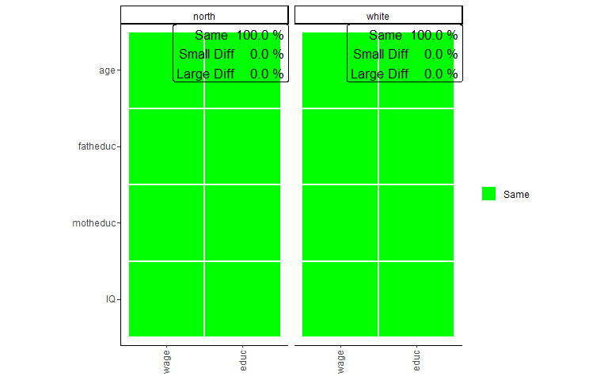

Introduction to the SampcompR Package
================
Bjoern Rohr (<bjoern.rohr@gesis.org>)

# sampcompR

<!-- badges: start -->
<!-- badges: end -->

SampcompR aims to compare the similarity of one or more data frames with
one or more benchmark data frames. This is done on a univariate,
bivariate, and multivariate level. The main intention of the package was
to compare surveys to benchmark surveys, although other comparisons are
also viable. (e.g., mode-comparisons)  

- On the univariate level, the variables with the same name in data
  frames and benchmarks are compared using one of the different
  measures. Then a plot can be generated to visualize the differences
  and present a value indicating the overall difference of all variables
  (e.g., average difference, RMSE).

- On the bivariate level, Pearson’s r values can be compared between the
  data frames and the benchmarks. The results of this comparison can
  also be visualized with a plot in the form of a heatmap.

- Last, on the multivariate level, the package can compare and visualize
  multivariate regression models between the data frames and the
  benchmarks.

## Installation

You can install the development version of sampcompR like so:

    ### Install the dependencies
    install.packages("devtools")

    install.packages(c("boot", "data.table", "dplyr", "ggplot2", "Hmisc", "jtools",
                       "lmtest", "magrittr", "margins", "parallel", "psych", "reshape2",
                       "readr", "svrep", "sandwich", "stats", "survey", "tidyselect", 
                       "utils","weights", "wooldridge"))

    ### Install the package
    devtools::install_github("BjoernRohr/sampcompR")

    library(sampcompR)

## Example

### Prepare the Data

When using the package, the first step is to load your data. It is
essential that the variables of comparison in the data frames and
respective benchmark data frames need to be named the same.
Additionally, it is best to try to measure the same constructs
similarly. For example, if you want to compare two surveys, it is best
if the same questions were used in the respective surveys for the
variables of comparison.

In our example, we will use the `card` data frame from the `wooldrige`
package as a base and split it into different sub-data frames. To keep
our examples simple, we will not use design weights, although design
weights can make a huge difference.

``` r
# install and load some additional packages for this readme
#install.packages("wooldridge","magrittr","knitr","kableExtra")
library(wooldridge)
#> Warning: Paket 'wooldridge' wurde unter R Version 4.2.3 erstellt
library(magrittr)
#> Warning: Paket 'magrittr' wurde unter R Version 4.2.3 erstellt
library(knitr)
#> Warning: Paket 'knitr' wurde unter R Version 4.2.3 erstellt
library(kableExtra)
#> Warning: Paket 'kableExtra' wurde unter R Version 4.2.3 erstellt


card<-wooldridge::card

# we recode the married variable to a dummy, idicating of the respondents are married or not, which will be needed later. 
card$married[card$married!=1]<-0

south<-card[card$south==1,] # only respondets that lived in the south
north<-card[card$south==0,] # only respondets that lived in the north
black<-card[card$black==1,] # only black respondets.
white<-card[card$black==0,] # only white respondets.


### install some other 
```

Splitting the data frame into subgroups allows us to compare if the
subgroups differ, for example, if the respondents living in the `North`
are different from those living in the `South` or if `black` respondents
are different from `white`. This could be useful, for example, as a
robustness check, if we fear that the estimates we found in our study
based on the whole data frame might differ for specific sub-groups.

### Univariate Comparison

Now that we have data frames we want to compare that are gathered
similarly, we will start with a univariate comparison.

``` r
library(sampcompR)

univar_data<-sampcompR::uni_compare(dfs = c("north","black"),
                                    benchmarks = c("south","white"),
                                    variables=c("age","educ","fatheduc",
                                                "motheduc","wage","IQ"),
                                    funct = "rel_mean",
                                    nboots=0,
                                    summetric="avg",
                                    data=T,type = "comparison")
sampcompR::plot_uni_compare(univar_data)
```


Here we can see a plot showing the difference in mean for several
variables (indicated in the `variables` parameter) in the data frames.
The first data frame, named as a character in `dfs`, is compared to the
first data frame in `benchmarks`, while the second is compared to the
second, and so forth. Another important parameter is `nboots`. It
indicates the number of bootstraps to calculate the confidence
intervals. We recommend using at least 2000 to 10000 bootstraps,
although this may take a while. To make this ´readme´ more accessible,
we lower the number of bootstraps for this example. It is also possible
to set `nboots==0`. In this case, the confidence intervals will be
calculated analytically. The upper right corner of the plot shows the
average relative difference in mean, which is chosen by using
`summetric=="avg"`. Last, the parameter data indicates if the function
should return a `uni_compare_object` which can be used in other package
functions (e.g., plot_uni_compare).

Also, the difference can be shown in a table that can be helpful to
document the results. We can easily get a good result table by adding
the resulting table to other functions (e.g., the kable() function in
RMarkdown).

``` r
uni_output_table<-sampcompR::uni_compare_table(univar_data)
```

**Table 1**

| variables     |     north      |      black       |
|:--------------|:--------------:|:----------------:|
| age           |     0.006      |      -0.012      |
|               |  (\>0, 0.011)  | (-0.02, -0.004)  |
| educ          |     0.087      |      -0.125      |
|               | (0.078, 0.096) | (-0.139, -0.111) |
| fatheduc      |     0.186      |      -0.304      |
|               | (0.168, 0.205) | (-0.341, -0.267) |
| motheduc      |     0.149      |      -0.23       |
|               | (0.135, 0.163) | (-0.256, -0.204) |
| wage          |     0.276      |      -0.273      |
|               | (0.251, 0.301) | (-0.296, -0.25)  |
| IQ            |     0.065      |      -0.177      |
|               | (0.057, 0.073) | (-0.193, -0.161) |
| Average Error |     0.128      |      0.187       |
| RANK          |       1        |        2         |
| N             |      1795      |       703        |

Difference in Relative Means off different Survey Groups

The table displays the difference between dfs and benchmarks for all
variables, the confidence intervals, and the summary metric specified
when creating the `uni_compare_object` for every comparison.

### Bivariate Comparison

As with the univariate comparison, we start with a general function to
calculate the bivariate difference between the data frames and plot the
results.

``` r
biv_data<-sampcompR::biv_compare(dfs = c("north","black"),
                                 benchmarks = c("south","white"),
                                 variables= c("age","educ","fatheduc",
                                             "motheduc","wage","IQ"),
                                 data=T)

sampcompR::plot_biv_compare(biv_data)
```


In this comparison, the Pearson’s r correlations of all variables
indicated in the `variables` parameter are compared between the data
frames and benchmarks. The plotted heatmap shows the difference in three
categories. A correlation is green (Same) for one of two reasons. On the
one hand, it can be that the Pearson’s r correlation of this variable
pair is not significant in the data frame and in the benchmark. On the
other hand, it can be that both z standardized Pearson’s r values are
not significantly different. If neither of these conditions is true, the
plot’s correlations are marked yellow (Small Diff) or red (Large Diff).
To be red, it must also fulfill one of two additional conditions. The
Pearson’s r correlations could be of different directions (e.g., one is
positive, while the other is negative). Second, it could be that one of
them is double the size of the other.

In our example, we can see on the left that the respondents living in
the `North` are very different from those living in the `South`
regarding the investigated bivariate correlations. Only 33.3% of all
correlations are similar between both groups (`Same`) and would lead to
similar interpretations measured with either group of the survey. 46,7%
of correlations show minor differences (`Small Diff`), meaning that
similar interpretations may not be guaranteed, while 20% of the
correlations are very different (`Large Diff`) between the groups. The
right half of the plot shows the comparison between `black` and `white`
respondents, where fewer differences are found.

As before, we can also take a closer look at the exact values by putting
the `biv_compare_object` into the `biv_compare_table` function of our
package.

``` r
# Difference correlation matrix of the first comparison
table_biv1<-sampcompR::biv_compare_table(biv_data,type = "diff",comparison_number=1) 
```

**Table 2**

|          |    age     |    educ     |  fatheduc   |  motheduc  | wage  | IQ  |
|:---------|:----------:|:-----------:|:-----------:|:----------:|:-----:|:---:|
| age      |            |             |             |            |       |     |
| educ     |  0.12\*\*  |             |             |            |       |     |
| fatheduc |    0.02    | -0.11\*\*\* |             |            |       |     |
| motheduc |   -0.05    | -0.13\*\*\* |  -0.08\*\*  |            |       |     |
| wage     | 0.12\*\*\* | -0.18\*\*\* | -0.16\*\*\* | -0.2\*\*\* |       |     |
| IQ       |    0.04    |      0      |  -0.14\*\*  |   -0.1\*   | -0.07 |     |

Difference in Pearson’s r for the North/South Sample

Using `"diff"` for the `type` parameter and `1` in `comparison_number`
gives us a matrix for the difference in Pearson’s r between the surveys.
Here we can again see what correlations significantly differ between the
surveys and to what extent. However, to know why the colors are as they
are in the plot, we must also look at the individual correlation
matrices for both surveys. Here we only look at the tables for comparing
north versus south respondents as an example.

``` r
# North correlation matrix of the first comparison
table_biv2<-sampcompR::biv_compare_table(biv_data,type = "dfs",comparison_number=1) 

# South correlation matrix of the first comparison
table_biv3<-sampcompR::biv_compare_table(biv_data,type = "benchmarks",comparison_number=1) 
```

**Table 3**

|          |    age     |    educ    |  fatheduc  |  motheduc  |    wage    | IQ  |
|:---------|:----------:|:----------:|:----------:|:----------:|:----------:|:---:|
| age      |            |            |            |            |            |     |
| educ     |    0.04    |            |            |            |            |     |
| fatheduc |  -0.06\*   | 0.41\*\*\* |            |            |            |     |
| motheduc | -0.07\*\*  | 0.36\*\*\* | 0.57\*\*\* |            |            |     |
| wage     | 0.34\*\*\* | 0.19\*\*\* | 0.09\*\*\* |  0.08\*\*  |            |     |
| IQ       |   -0.05    | 0.51\*\*\* | 0.26\*\*\* | 0.25\*\*\* | 0.14\*\*\* |     |

Pearson’s r correlation matrix for the North Sample

**Table 4**

|          |    age     |    educ    |  fatheduc  |  motheduc  |    wage    | IQ  |
|:---------|:----------:|:----------:|:----------:|:----------:|:----------:|:---:|
| age      |            |            |            |            |            |     |
| educ     | -0.08\*\*  |            |            |            |            |     |
| fatheduc |  -0.09\*   | 0.52\*\*\* |            |            |            |     |
| motheduc |   -0.02    | 0.49\*\*\* | 0.66\*\*\* |            |            |     |
| wage     | 0.23\*\*\* | 0.38\*\*\* | 0.25\*\*\* | 0.28\*\*\* |            |     |
| IQ       |  -0.09\*   | 0.51\*\*\* | 0.4\*\*\*  | 0.35\*\*\* | 0.21\*\*\* |     |

Pearson’s r correlation matrix for the South Sample

This shows us the whole picture. Looking at the correlation between age
and education, for example, we can see that the correlations in both
surveys are small. Additionally, the correlation is positive and
insignificant in the north group, while it is negative and significant
in the south group. Here, in addition to the conditions for a slight
difference, both conditions for a `Large Diff` are true. However,
looking at the correlations between wage and the father’s education, as
well as the mother’s education, we see that only the difference in size
was the reason for the `Large Diff` category. Nonetheless, we would come
to very different conclusions measuring those correlations for either
group.

### Multivariate Comparison

When you want to know how different certain data frames or sub-data
frames are, it may also be interesting to see if those differences exist
in multivariate comparisons. For this, the first step is to choose the
multivariate models we want to compare. This function
`(multi_compare())` is restricted to `ols` and `logit` regressions,
without interactions. However, there is another function,
`multi_compare2(),` that can compare any model commutable with `glm()`
(without weighting) or `svyglm()` (when weights are provided). In this
example, `multi_compare()` will be enough, as we want to see if there
are differences between the groups when looking at the regression of
`age`, `father's education`, `mother's education`, and `IQ` on wage and
education.

After choosing independent and dependent variables, all information can
be given into `multi_compare()`. For this comparison, three similar
regression models are performed. One model with either survey and one
model with the combined surveys, including an interaction variable that
indicates what survey the respondents are from. After this, for every
coefficient, a similar classification is used, as in the bivariate
comparison:

``` r

# designate dependent variables 
dependent_ols<-c("wage","educ")

# designate independent variables
independent<-c("age","fatheduc","motheduc","IQ")

# compare the north and south data frames
multi_data1_ols<-sampcompR::multi_compare(df=north, 
                                     bench=south,
                                     independent = independent,
                                     dependent = dependent_ols,
                                     method = "ols")  
#> 
#> Difference in coeficients between samples 
#>  
#>          wage         educ        
#> age      -3.74e+00    -7.91e-02*  
#> fatheduc -3.11e+00    -4.41e-02   
#> motheduc  5.40e+00     4.34e-02   
#> IQ        8.34e-01    -1.85e-02** 
#> 
#> Overall difference between north & south: 25% of coeficients are significant different
#> (*p<0.05 ; **p<0.005 ; ***p<0.001;  for t-test robust standard errors are used) 
#> 

# compare the black and white data frames
multi_data2_ols<-sampcompR::multi_compare(df=black, 
                                     bench=white,
                                     independent = independent,
                                     dependent = dependent_ols,
                                     method = "ols")
#> 
#> Difference in coeficients between samples 
#>  
#>          wage         educ        
#> age       1.27e+01     7.05e-02   
#> fatheduc  4.91e-01     7.38e-02   
#> motheduc  6.94e-01    -1.13e-01   
#> IQ       -5.40e-01     2.89e-02** 
#> 
#> Overall difference between black & white: 12.5% of coeficients are significant different
#> (*p<0.05 ; **p<0.005 ; ***p<0.001;  for t-test robust standard errors are used) 
#> 

# plot the results
sampcompR::plot_multi_compare(c("multi_data1_ols","multi_data2_ols"),
                             plots_label=c("north","black"))
```



The plot looks very similar, except that every row shows a coefficient
while every column shows a model. Here the green color (Same) indicates
that a coefficient is not significantly different in any of the models
performed with the individual surveys or that the interaction effect in
the model on the pooled data frames is not significant. Similarly,
yellow (Small Diff) or red (Large Diff) indicates that the coefficient
is significant in one of the base models, and the interaction effect is
significant in the pooled models. If those conditions are true, it is
red (Large Diff) if the coefficients differ in direction or one is the
size of the other and yellow (Small Diff) otherwise.

As we can see here in those models, there are fewer differences than
before in the bivariate comparison, especially in the models based on
the black comparison between the black and the white sub-data frames, at
least for those models compared. Also, we can see that the differences
on the wage variable we found in previous comparisons are not present in
the multivariate model. However, even in multivariate regression,
education seems more prone to group differences.

In addition to the models, we can answer with an ols regression, it
would also be interesting to add a model estimating a marriage model.
However, for this, we need a logit regression, which now follows.

``` r

# logit dependent variable


dependent_log<-c("married")


# compare the north and south data frames
multi_data1_log<-sampcompR::multi_compare(df=north, 
                                     bench=south,
                                     independent = independent,
                                     dependent = dependent_log,
                                     method = "logit")  
#> 
#> Difference in coeficients between samples 
#>  
#>          married     
#> age       1.86e-02   
#> fatheduc -1.00e-02   
#> motheduc  2.17e-02   
#> IQ        1.07e-03   
#> 
#> Overall difference between north & south: 0% of coeficients are significant different
#> (*p<0.05 ; **p<0.005 ; ***p<0.001;  for t-test robust standard errors are used) 
#> 

# compare the black and white data frames
multi_data2_log<-sampcompR::multi_compare(df=black, 
                                     bench=white,
                                     independent = independent,
                                     dependent = dependent_log,
                                     method = "logit")
#> 
#> Difference in coeficients between samples 
#>  
#>          married     
#> age       3.54e-02   
#> fatheduc -8.37e-02   
#> motheduc  1.99e-01*  
#> IQ       -4.24e-03   
#> 
#> Overall difference between black & white: 25% of coeficients are significant different
#> (*p<0.05 ; **p<0.005 ; ***p<0.001;  for t-test robust standard errors are used) 
#> 


# merge those  multi_compare_objects to the ols based objects

final_multi1<-sampcompR::multi_compare_merge(multi_data1_ols,multi_data1_log)

final_multi2<-sampcompR::multi_compare_merge(multi_data2_ols,multi_data2_log)


# plot the models together
sampcompR::plot_multi_compare(c("final_multi1","final_multi2"),
                             plots_label=c("north","black"))
```


After performing the same comparison with the `method = logit`, and with
the new dependent variable, it would still be interesting two plot all
models together. This can be done with the function
`multi_compare_merge`, which adds multi_compare_objects together and use
the newly created objects for the plot. This shows us that in addition
to the education model, in the marriage model, one coefficient is
different for black respondents than for white respondents.

We also add the objects into the provided table function to look at the
differences closer.

``` r
### difference table
multi_table1 <- sampcompR::multi_compare_table(c("final_multi1","final_multi2"),type="diff")
multi_table2 <-sampcompR::multi_compare_table(c("final_multi1","final_multi2"),type="dfs")
multi_table3 <-sampcompR::multi_compare_table(c("final_multi1","final_multi2"),type="benchmarks")
```

**Table 5**

| data_frames | variables |  wage   |    educ    | married |
|:------------|:---------:|:-------:|:----------:|:-------:|
| north       |    age    |  -3.74  |  -0.079\*  |  0.019  |
|             |           | (4.455) |  (0.034)   | (0.048) |
|             | fatheduc  |  -3.11  |   -0.044   |  -0.01  |
|             |           | (4.582) |  (0.035)   | (0.045) |
|             | motheduc  |   5.4   |   0.043    |  0.022  |
|             |           | (5.376) |  (0.041)   | (0.054) |
|             |    IQ     |  0.834  | -0.019\*\* |  0.001  |
|             |           | (0.911) |  (0.007)   | (0.009) |
| black       |    age    |  12.7   |   0.071    |  0.035  |
|             |           | (7.095) |  (0.054)   | (0.069) |
|             | fatheduc  |  0.491  |   0.074    | -0.084  |
|             |           | (7.236) |  (0.055)   | (0.067) |
|             | motheduc  |  0.694  |   -0.113   | 0.199\* |
|             |           | (7.937) |   (0.06)   | (0.08)  |
|             |    IQ     |  -0.54  | 0.029\*\*  | -0.004  |
|             |           | (1.423) |  (0.011)   | (0.013) |

Multivariate Comparison of Subgroups of the Card Sample : Interaction
Models

**Table 6**

| data_frames | variables |    wage    |    educ     |   married   |
|:------------|:---------:|:----------:|:-----------:|:-----------:|
| north       |    age    | 33.6\*\*\* | 0.099\*\*\* | 0.168\*\*\* |
|             |           |  (2.539)   |   (0.019)   |   (0.026)   |
|             | fatheduc  |    5.62    | 0.156\*\*\* |   -0.016    |
|             |           |  (2.949)   |   (0.022)   |   (0.028)   |
|             | motheduc  |    2.81    |  0.085\*\*  |   -0.066    |
|             |           |  (3.518)   |   (0.026)   |   (0.034)   |
|             |    IQ     | 2.05\*\*\* | 0.068\*\*\* |   -0.002    |
|             |           |  (0.545)   |   (0.004)   |   (0.005)   |
| black       |    age    |  21\*\*\*  |    0.016    |   0.139\*   |
|             |           |  (5.425)   |   (0.054)   |   (0.065)   |
|             | fatheduc  |    4.71    |    0.073    |    0.049    |
|             |           |   (5.49)   |   (0.054)   |   (0.063)   |
|             | motheduc  |    4.26    |  0.2\*\*\*  | -0.231\*\*  |
|             |           |  (5.952)   |   (0.059)   |   (0.075)   |
|             |    IQ     |   2.71\*   | 0.041\*\*\* |   -0.004    |
|             |           |  (1.075)   |   (0.011)   |   (0.012)   |

Multivariate Comparison of Subgroups of the Card Sample : North and
Black Sample Models

**Table 7**

| data_frames | variables |    wage    |    educ     |   married   |
|:------------|:---------:|:----------:|:-----------:|:-----------:|
| south       |    age    | 29.8\*\*\* |    0.02     | 0.186\*\*\* |
|             |           |  (3.492)   |   (0.028)   |   (0.041)   |
|             | fatheduc  |    2.52    | 0.112\*\*\* |   -0.026    |
|             |           |  (3.364)   |   (0.027)   |   (0.035)   |
|             | motheduc  |   8.21\*   | 0.129\*\*\* |   -0.044    |
|             |           |  (3.904)   |   (0.032)   |   (0.042)   |
|             |    IQ     | 2.88\*\*\* | 0.05\*\*\*  |   -0.001    |
|             |           |  (0.697)   |   (0.006)   |   (0.007)   |
| white       |    age    | 33.7\*\*\* | 0.087\*\*\* | 0.174\*\*\* |
|             |           |   (2.21)   |   (0.016)   |   (0.023)   |
|             | fatheduc  |   5.2\*    | 0.147\*\*\* |   -0.035    |
|             |           |  (2.415)   |   (0.018)   |   (0.023)   |
|             | motheduc  |    4.95    | 0.088\*\*\* |   -0.032    |
|             |           |  (2.894)   |   (0.021)   |   (0.028)   |
|             |    IQ     | 2.17\*\*\* | 0.07\*\*\*  |   -0.009    |
|             |           |  (0.491)   |   (0.004)   |   (0.005)   |

Multivariate Comparison of Subgroups of the Card Sample : South and
White Sample Models

Now looking, for example, at the `motheduc` coefficient in the second
comparison, we can see that there is a significant negative effect of
the mother’s education getting married. At the same time, there is no
significant effect for white respondents. This means that a model based
on the whole sample could lead to wrong conclusions for this
coefficient. On the other hand father’s education seems to have a
similar effect on both groups.

Overall the comparison shows differences between the sub-groups in some
cases. Suppose those cases play a role in the overall analyses of a
research project. Splitting the data and reporting different results
depending on the group could make sense in that case. On the other hand,
if we only want to look at the `wage` model, there seem to be fewer
differences in our example, and splitting the data frame into different
groups might be unnecessary.

## Further Use-Cases

As we have shown, the package can be handy in finding differences
between groups, which could come in handy, for example, as robustness
checks in a research paper. However, group comparisons are only one
possible use case. Other examples could be comparing survey respondents
to non-respondents (e.g., by comparing information known in the sample
frame in probability surveys) or comparing two survey modes when a
sample was gathered using differing modes.

In a preprint (Rohr et al., 2023), we used the package (which was
created and designed in this context) to compare several non-probability
and probability surveys against a benchmark survey.

## Components of the package

In general, the package’s functions can be ordered into one of four
categories. When using the functions of the package, it also makes sense
to take a look into the help section, as most include optional
parameters, for example, to weight the data or include a p_value
adjustment (e.g., a Bonferroni adjustment) to adjust for the problem of
multiple comparisons.

### Univariate Comparison Functions

- `uni_compare()` can be used to make a univariate comparison and get an
  object usable in the other univariate comparison functions or plot the
  results directly.

- `uni_compare2()` is similar to uni_compare() but better suited for
  weighted comparisons.

- `plot_uni_compare()` can be used to plot the results of the
  `uni_compare()` function.

- `uni_compare_table()` can be used to get a table for the results of
  the `uni_compare()` function.

- `R_indicator` calculates the R-Indicator of a Survey.

### Bivariate Comparison Functions

- `biv_compare()` can be used to make a bivariate comparison and get an
  object usable in the other bivariate comparison functions or plot the
  results directly.

- `plot_biv_compare()` can be used to plot the results of the
  `biv_compare()` function.

- `biv_compare_table()` can be used to get a table for the results of
  the `biv_compare()` function.

### Multivariate Comparison Functions

- `multi_compare()` can be used to make a multivariate comparison and
  get an object usable in the other bivariate comparison functions or
  plot the results directly.

- `multi_compare2()` needs a slightly more complicated input, however,
  it is suitable to compare any glm() model between the data frame and
  the benchmark.

- `plot_multi_compare()` can be used to plot the results of the
  `multi_compare()` function.

- `multi_compare_table()` can be used to get a table for the results of
  the `multi_compare()` function.

- `multi_compare_merge()` can combine objects of the multi_compare()
  function, to plot them together.

### Miscellaneous Functions

- `dataequalizer()` can be used to reduce one data frame to only columns
  named similarly in another data frame and a list of variables given to
  the function.

## References

Rohr, B., Silber, H., Felderer, B. (2023), “Comparing the accuracy of
univariate, bivariate, and multivariate estimates across probability and
non-probability surveys with populations benchmarks”, SocArXiv,
Available at <https://doi.org/10.31235/osf.io/n6ehf>
